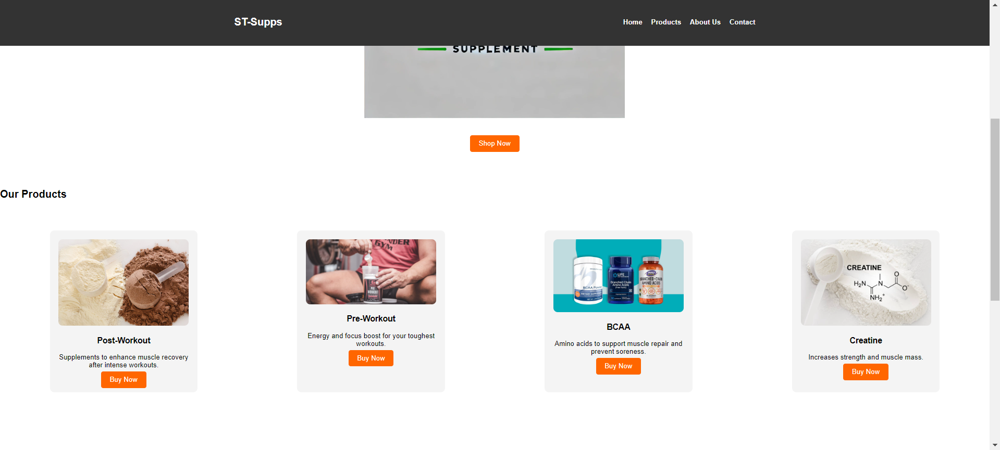
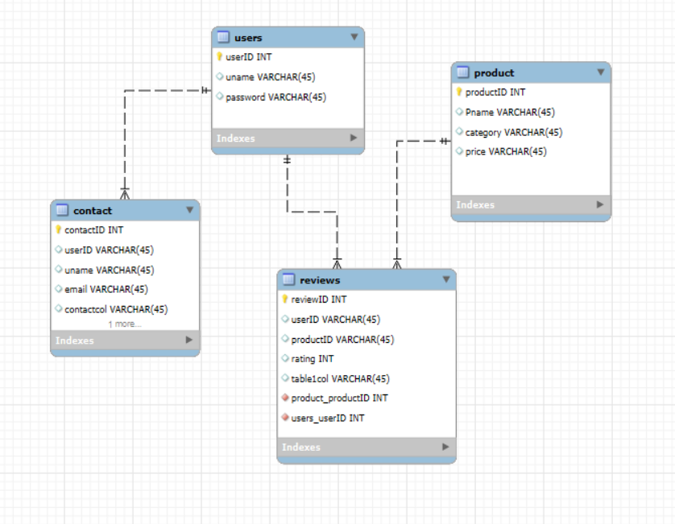

# ST-Supps
Creating a sports supplement website that helps customers find supplements through various different stores. The goal is to help customers find products that are cheap and where they are be sold at. Our website will be a linking host website that link products from different stores. 

This database design supports a simple e-commerce or review-based application where users can create accounts, products can be listed, and users can leave reviews on products. Each table is connected via foreign keys, ensuring referential integrity between users, their contact information, and their product reviews.

